# Implementation Plan: NOCTIS

## Overview

Преобразуем дизайн NOCTIS в серию задач для агента-кодогенератора. Каждый шаг наращивает работающий результат предыдущего и заканчивается интеграцией: ничего «висящего», что не подцеплено к существующим компонентам. Все 14 свойств корректности (P1–P14) из `design.md` покрываются property-based-тестами (минимум 100 итераций, для P1 и P2 — 500). Конкретные пути файлов указаны для каждой задачи.

Языки и инструменты зафиксированы дизайном:
- Бэкенд — Go 1.22, Fiber, WebSocket, `gopter` для PBT, `gojsonschema` для валидации, `goose` для миграций.
- Клиент — Flutter 3.x / Dart 3.x, Riverpod 2.x (codegen), Drift + SQLCipher, `glados` для PBT.
- Provision и интеграционные пробы — Bash + `bats-core` для проверки идемпотентности.

Сокращения в ссылках:
- `_Requirements: X.Y_` — ссылается на конкретный пункт acceptance criteria из `requirements.md`.
- `_Properties: PN_` — ссылается на свойство из `Correctness Properties` в `design.md`.

## Tasks

- [ ] 1. Монорепо и базовая конфигурация
  - [ ] 1.1 Создать структуру монорепо
    - Каталоги: `noctis_app/` (Flutter), `noctis_backend/` (Go), `deploy/`, `api/`, `docs/`, `.github/workflows/`
    - Root `README.md` со ссылками на `.kiro/specs/monochrome-messenger/{requirements,design,tasks}.md`
    - _Requirements: 44.2_
  - [ ] 1.2 Конфигурация репозитория
    - `.gitignore` (Flutter+Go+IDE+OS), `.editorconfig`, `LICENSE`
    - `.gitattributes` с фиксированными концами строк для Bash и YAML
    - _Requirements: 44.2_
  - [ ] 1.3 Корневой Makefile
    - Цели: `make backend-run`, `make backend-test`, `make app-test`, `make lint`, `make schema-validate`, `make provision-test`
    - _Requirements: 47.1, 50.3_

- [ ] 2. Foundation Go-бэкенда
  - [ ] 2.1 Точка входа и graceful shutdown
    - `noctis_backend/cmd/noctis/main.go`: parse env → wire deps → start Fiber → ловить `SIGINT`/`SIGTERM` через `context.WithCancel`
    - _Requirements: 47.1, 47.4_
  - [ ] 2.2 Парсинг конфигурации и валидация
    - `noctis_backend/internal/config/config.go`: `Load()` читает `DATABASE_URL`, `REDIS_URL`, `JWT_SECRET_CURRENT`, `JWT_SECRET_PREVIOUS`, `S3_*`, `SMS_PROVIDER*`, `SMTP_URL`, `APP_DOMAIN`, `LOG_LEVEL`, `TURN_*`
    - При отсутствии обязательной переменной — выход с кодом 1 и сообщением о недостающей переменной
    - _Requirements: 59.1, 59.2_
  - [ ] 2.3 Транспортный слой Fiber
    - `noctis_backend/internal/transport/router.go`: middleware `recover`, `request_id` (генерация при отсутствии `X-Request-ID`), `cors`
    - `noctis_backend/internal/transport/wshub.go`: hub соединений, регистрация/удаление, broadcast по `user_id`/`chat_id`
    - _Requirements: 47.1, 47.3, 52.3_
  - [ ] 2.4 Логирование и метрики
    - `noctis_backend/internal/observability/logger.go`: `zerolog` JSON, поля `timestamp`, `level`, `request_id`, `user_id`, `event`
    - `noctis_backend/internal/observability/metrics.go`: реестр `prometheus.NewRegistry()`, `/metrics` handler
    - _Requirements: 47.5, 52.1, 52.2, 52.3_
  - [ ] 2.5 Postgres-пул
    - `noctis_backend/internal/storage/postgres/pool.go`: `pgxpool` с лимитами из конфига, healthcheck-функция
    - _Requirements: 48.1_
  - [ ] 2.6 Redis-клиент
    - `noctis_backend/internal/storage/redis/client.go`: `go-redis/v9`, ping-проверка, retry
    - _Requirements: 49.1_
  - [ ] 2.7 MinIO-клиент
    - `noctis_backend/internal/storage/minio/client.go`: `aws-sdk-go-v2` с `s3.UsePathStyle = true`, создание бакета `noctis-media` если нет
    - _Requirements: 13.4_
  - [ ] 2.8 SIGHUP — горячая смена уровня лога
    - В `main.go` обработчик сигнала перечитывает `LOG_LEVEL` и обновляет `zerolog.SetGlobalLevel`
    - _Requirements: 59.3_
  - [ ] 2.9 Healthz-endpoint
    - `noctis_backend/internal/transport/health.go`: проверяет PG/Redis/MinIO и возвращает 200 если все OK
    - _Requirements: 47.4, 60.3_

- [ ] 3. Миграции схемы (goose)
  - [ ] 3.1 Миграция `001_users_devices_sessions.sql`
    - Таблицы `users`, `devices`, `sessions`, индекс `idx_sessions_user_active`
    - _Requirements: 5.1, 5.2, 5.3, 48.2_
  - [ ] 3.2 Миграция `002_chats_members.sql`
    - Тип `chat_kind`, таблицы `chats`, `chat_members`
    - _Requirements: 7.1, 12.4, 18.4, 28.1, 48.2_
  - [ ] 3.3 Миграция `003_messages_edits_reactions.sql`
    - Тип `message_kind`, таблица `messages` с уникальностями `(chat_id, seq)` и `(chat_id, sender_id, client_message_id)`, индексы FTS на `russian`/`english`/`simple`, индексы `chat_created`, `sender`, `expires`, `scheduled`; таблицы `message_edits`, `message_reactions`
    - _Requirements: 7.2, 7.4, 9.1, 9.4, 10.1, 10.5, 11.3, 19.2, 20.1, 25.1, 48.3_
  - [ ] 3.4 Миграция `004_attachments.sql`
    - Таблица `attachments`, ограничение `size_bytes <= 2199023255552`, индекс по `message_id`
    - _Requirements: 13.1, 13.4, 14.2_
  - [ ] 3.5 Миграция `005_drafts.sql`
    - Таблица `drafts` с PK `(user_id, chat_id)`
    - _Requirements: 22.1, 22.2_
  - [ ] 3.6 Миграция `006_smart_tags_chat_tags_folders.sql`
    - Таблицы `smart_tags`, `chat_tags`, `folders`
    - _Requirements: 17.1, 17.2, 18.1, 18.2_
  - [ ] 3.7 Миграция `007_sticker_sets_stickers.sql`
    - Таблицы `sticker_sets` (с `invite_slug`), `stickers`
    - _Requirements: 23.1, 23.3_
  - [ ] 3.8 Миграция `008_polls.sql`
    - Таблица `polls`, ограничения длины вопроса
    - _Requirements: 34.1, 34.2_
  - [ ] 3.9 Миграция `009_calls.sql`
    - Типы `call_kind`, `call_status`, таблица `calls`
    - _Requirements: 15.6_
  - [ ] 3.10 Миграция `010_blocks_push_tokens.sql`
    - Таблицы `blocks`, `push_tokens`
    - _Requirements: 16.1, 35.1_
  - [ ] 3.11 Миграция `011_audit_log.sql`
    - Таблица `audit_log` для модерации и критичных операций
    - _Requirements: 36.2, 38.1_
  - [ ] 3.12 Запуск миграций
    - `noctis_backend/internal/storage/postgres/migrate.go`: вызов `goose.Up` с эмбедом каталога `migrations/`; запуск из `main.go` до открытия слушателя
    - _Requirements: 48.2_

- [ ] 4. JSON Schema, OpenAPI и парсер протокола (P1)
  - [ ] 4.1 JSON Schema WebSocket-протокола
    - `api/ws-schema.json`: конверт `{v, id, type, ts, ref_id, payload}` с `additionalProperties: false`; `$defs` для каждого `payload` (MessageSend, MessageAck, MessageNew, MessageEdit, MessageDelete, Reaction, Typing*, Presence, ReadReceipt, SecretMessage, Call*)
    - _Requirements: 50.2, 63.1, 63.2_
  - [ ] 4.2 OpenAPI 3.1
    - `api/openapi.yaml`: все эндпоинты из таблицы дизайна (`/auth/*`, `/me`, `/contacts/sync`, `/chats*`, `/media/upload*`, `/media/{id}`, `/calls/turn-credentials`, `/notifications/devices`, `/healthz`, `/metrics`)
    - Описание ошибок: `INVALID_OTP`, `EMAIL_TOKEN_INVALID`, `SESSION_INVALID`, `RATE_LIMITED`, `USERNAME_TAKEN`, `EDIT_WINDOW_EXPIRED`, `CLOUD_PASSWORD_INVALID`, `PROTOCOL_VALIDATION_FAILED`
    - _Requirements: 50.1, 50.3_
  - [ ] 4.3 Конверт и DTO
    - `noctis_backend/internal/protocol/envelope.go`: `Envelope` тип, типизированные payload-структуры через interface `Payload`
    - _Requirements: 63.1, 63.2_
  - [ ] 4.4 Парсер
    - `noctis_backend/internal/protocol/parse.go`: `Parse([]byte) (Envelope, error)`; валидация через `gojsonschema` со встроенной (`embed.FS`) `ws-schema.json`; маппинг `payload` по `type`
    - При ошибке схемы — `PROTOCOL_VALIDATION_FAILED` с описанием первого нарушения
    - _Requirements: 63.1, 63.4_
  - [ ] 4.5 Сериализатор
    - `noctis_backend/internal/protocol/serialize.go`: `Serialize(Envelope) ([]byte, error)`; canonical-marshal (отсортированные ключи) + повторная валидация
    - _Requirements: 63.2_
  - [ ] 4.6* Property-test P1: round-trip протокола
    - **Property 1: Round-trip парсера/сериализатора WebSocket**
    - `noctis_backend/internal/protocol/parse_property_test.go`: 500 итераций через `gopter`; генератор валидных envelope для каждого `type`; проверка `parse(serialize(parse(b))) == parse(b)`
    - _Requirements: 63.1, 63.2, 63.3_
    - _Properties: P1_
  - [ ] 4.7* Property-test P1 (negative)
    - **Property 1 (negative): отказ при нарушении схемы**
    - 500 итераций; «мутации» валидных envelope (удаление поля, тип-несоответствие, доп. ключи) → парсер возвращает `PROTOCOL_VALIDATION_FAILED`
    - _Requirements: 63.4_
    - _Properties: P1_

- [ ] 5. Auth_Service (P6, P8)
  - [ ] 5.1 Argon2id для облачного пароля
    - `noctis_backend/internal/auth/argon2id.go`: `Hash`, `Verify` с `time=3, memory=64MiB, parallelism=4, salt=16B, key=32B`
    - _Requirements: 4.1_
  - [ ] 5.2 JWT с ротацией ключей
    - `noctis_backend/internal/auth/jwt.go`: `Issue(sub, sid, did, scope)` HS256, TTL 3600 с; `Verify` пробует `JWT_SECRET_CURRENT` и `JWT_SECRET_PREVIOUS`
    - _Requirements: 1.2, 3.2_
  - [ ] 5.3 Refresh-токены
    - `noctis_backend/internal/auth/refresh.go`: 256-битный токен из `crypto/rand` → base64url; в Redis ключ `refresh:{sha256}` с TTL 2 592 000 с
    - _Requirements: 3.1, 3.2, 49.4_
  - [ ] 5.4 OTP
    - `noctis_backend/internal/auth/otp.go`: 6-значный код из `crypto/rand`; в Redis `otp:phone:{e164}` хранится SHA-256 кода с TTL 300 с
    - _Requirements: 1.1, 1.2_
  - [ ] 5.5 SmsSender
    - `noctis_backend/internal/auth/sms.go`: интерфейс + реализации `mock` (logger), `twilio`, `smsru`; выбор по `SMS_PROVIDER`
    - _Requirements: 1.1_
  - [ ] 5.6 EmailSender
    - `noctis_backend/internal/auth/email.go`: SMTP-клиент, шаблон письма со ссылкой `/auth/email/verify?token=...`; токен кладётся в Redis `email_token:{token}` с TTL 1800 с
    - _Requirements: 2.1, 2.2_
  - [ ] 5.7 Token-bucket rate-limiter
    - `noctis_backend/internal/ratelimit/token_bucket.go`: Lua-скрипт в Redis (`EVALSHA`) для атомарного `take(key, limit, window)`; конфигурируемые бакеты (sms-ip, sms-phone, otp, cloud-pwd, msg-user)
    - _Requirements: 1.4, 1.5, 2.5, 4.4, 54.1, 54.2, 54.3_
  - [ ] 5.8 Auth-handlers
    - `noctis_backend/internal/auth/handlers.go`: `POST /auth/phone/start`, `/phone/verify`, `/email/start`, `/email/verify`, `/cloud_password/set`, `/cloud_password/verify`, `/refresh`
    - При превышении лимитов — HTTP 429 + `Retry-After`
    - _Requirements: 1.1, 1.2, 1.3, 1.4, 1.5, 1.6, 2.1, 2.2, 2.3, 2.4, 2.5, 4.1, 4.2, 4.3, 4.4, 54.3_
  - [ ] 5.9 Управление сессиями
    - `noctis_backend/internal/auth/sessions.go` + `handlers_sessions.go`: `GET /auth/sessions`, `DELETE /auth/sessions/{id}`, `DELETE /auth/sessions`
    - При отзыве: удаление `refresh:{hash}` + проставление `sessions.revoked_at`
    - _Requirements: 3.3, 3.4, 3.5, 3.6, 38.1_
  - [ ] 5.10* Property-test P6: token-bucket
    - **Property 6: Инвариант token-bucket**
    - `noctis_backend/internal/ratelimit/property_test.go`: для всех `(L, W, C)` ∈ {(3,1ч,1ч),(5,1ч,1ч),(5,600с,900с),(1,60с,60с),(1,120с,120с),(10,∞,3600с),(30,1с,динам.)} запрос принимается ⇔ принятых в окне `< L`; при превышении возвращается 429 с `Retry-After ≤ C`
    - _Requirements: 1.4, 1.5, 2.5, 4.4, 54.1, 54.2, 54.3_
    - _Properties: P6_
  - [ ] 5.11* Property-test P8: инвалидация сессий
    - **Property 8: Инвалидация refresh-токенов и сессий**
    - `noctis_backend/internal/auth/sessions_property_test.go`: для произвольных множеств активных сессий и стратегий отзыва отозванный `refresh_hash` отсутствует в Redis, неотозванные — остаются валидными; `/auth/refresh` для отсутствующего токена возвращает `SESSION_INVALID`
    - _Requirements: 3.1, 3.4, 3.5, 3.6, 38.1_
    - _Properties: P8_

- [ ] 6. Messaging core (P3, P4)
  - [ ] 6.1 Репозиторий сообщений с `seq` и идемпотентностью
    - `noctis_backend/internal/messaging/repo.go`: транзакция `WITH next AS (... FOR UPDATE) INSERT ... ON CONFLICT (chat_id, sender_id, client_message_id) DO UPDATE SET edited_at = messages.edited_at RETURNING id, seq`
    - _Requirements: 7.2, 7.4_
  - [ ] 6.2 Fanout через Redis Pub/Sub
    - `noctis_backend/internal/messaging/fanout.go`: каналы `chat_chan:{chat_id}`, `user_chan:{user_id}`; интеграция с `wshub`
    - _Requirements: 49.3_
  - [ ] 6.3 История и пагинация
    - `noctis_backend/internal/messaging/history.go`: `GET /chats/{id}/messages?cursor&limit=50` сортировка `id DESC`
    - _Requirements: 9.1, 9.2, 9.3_
  - [ ] 6.4 Редактирование
    - `noctis_backend/internal/messaging/edit.go`: проверка автора, окна 48 ч (R10.1), запись в `message_edits`, ретрансляция `message.edit`
    - При просрочке — `EDIT_WINDOW_EXPIRED`
    - _Requirements: 10.1, 10.2, 10.5_
  - [ ] 6.5 Удаление
    - `noctis_backend/internal/messaging/delete.go`: режимы `for_me` (только sender flag) и `for_all` (стирание `body_text`/`body_ciphertext`, выставление `deleted_for_all_at`)
    - _Requirements: 10.3, 10.4_
  - [ ] 6.6 Реакции
    - `noctis_backend/internal/messaging/reactions.go`: upsert/delete в `message_reactions`, ретрансляция за ≤500 мс
    - _Requirements: 20.1, 20.2, 20.5_
  - [ ] 6.7 Пересылка
    - `noctis_backend/internal/messaging/forward.go`: батч до 100, метка `forward_from_user_id`; запрет если исходный чат `secret`
    - _Requirements: 21.1, 21.2, 21.3, 21.4, 26.3_
  - [ ] 6.8 Черновики
    - `noctis_backend/internal/messaging/drafts.go`: `PUT /chats/{id}/draft`, `DELETE`; пуш на `user_chan` для других устройств
    - _Requirements: 22.1, 22.2, 22.3_
  - [ ] 6.9 Read receipts с уважением приватности
    - `noctis_backend/internal/messaging/read_receipts.go`: ивент `read_receipt`; если у получателя `privacy.read_receipts = false` — не ретранслировать отправителю
    - _Requirements: 7.6, 27.2, 27.3_
  - [ ] 6.10 WS-маршрутизация `message.send` и `message.ack`
    - `noctis_backend/internal/messaging/ws_router.go`: разбор envelope, вызов repo, возврат `message.ack` с `server_message_id` и `seq`
    - _Requirements: 7.1, 7.3, 7.5_
  - [ ] 6.11* Property-test P3: идемпотентность по `client_message_id`
    - **Property 3: Идемпотентность отправки**
    - `noctis_backend/internal/messaging/idempotency_property_test.go`: 200 итераций; для случайного `(user, chat, client_message_id, k)` параллельные `k` отправок → ровно одна строка в `messages`, все ack возвращают одинаковый `server_message_id`
    - _Requirements: 7.4_
    - _Properties: P3_
  - [ ] 6.12* Property-test P4: монотонность `seq`
    - **Property 4: Монотонность и уникальность `seq`**
    - `noctis_backend/internal/messaging/seq_property_test.go`: 200 итераций конкурентных вставок в один `chat_id`; проверка строгого возрастания и уникальности `seq`
    - _Requirements: 7.2_
    - _Properties: P4_

- [ ] 7. Presence_Service
  - [ ] 7.1 Online-статус и `last_seen`
    - `noctis_backend/internal/presence/service.go`: при `OnConnect` → `SET presence:{user_id} 1 EX 90`; при `OnDisconnect` → `DEL presence:{user_id}` и `SET last_seen:{user_id} ts EX 2592000`
    - _Requirements: 8.4, 8.5, 49.2_
  - [ ] 7.2 Typing-индикатор
    - `noctis_backend/internal/presence/typing.go`: `SADD typing:{chat_id} user_id; EXPIRE 6`; ретрансляция `typing.start/stop` за ≤200 мс
    - _Requirements: 8.1, 8.2, 8.3_
  - [ ] 7.3 Presence-events на WS
    - `noctis_backend/internal/presence/ws.go`: подписка клиентов на `user_chan` контактов
    - _Requirements: 8.4, 8.5_

- [ ] 8. Чекпойнт — фундамент бэкенда
  - Ensure all tests pass, ask the user if questions arise.

- [ ] 9. Disappearing_Message (P5)
  - [ ] 9.1 Snapshot TTL при отправке
    - `noctis_backend/internal/messaging/ttl_snapshot.go`: при INSERT берём `chats.ttl_seconds` и пишем в `messages.ttl_seconds`
    - Список допустимых значений: `{5, 30, 60, 3600, 86400, 604800, 2592000}` (валидация в protocol-validators)
    - _Requirements: 11.1, 11.2, 11.4_
  - [ ] 9.2 Воркер удаления по `expiring_msg:zset`
    - `noctis_backend/internal/messaging/ttl_worker.go`: горутина с тиком 500 мс; `ZRANGEBYSCORE 0 now`; транзакция `DELETE FROM messages` + `ZREM`; публикация `message.delete` в `chat_chan`
    - _Requirements: 11.3_
  - [ ] 9.3 Управление TTL чата
    - `noctis_backend/internal/messaging/chat_ttl.go`: `PATCH /chats/{id}/ttl`, валидация значения, не задним числом
    - _Requirements: 11.1, 11.4_
  - [ ] 9.4* Property-test P5: точность TTL ±2 с и снапшот
    - **Property 5: TTL-снапшот и точность удаления**
    - `noctis_backend/internal/messaging/ttl_property_test.go`: 200 итераций со сжатым time-mock; для всех `(t, t', read_at)` старые сообщения держат `t`; фактическое удаление в `[r+t-2, r+t+2]`
    - _Requirements: 11.1, 11.2, 11.3, 11.4_
    - _Properties: P5_

- [ ] 10. Media_Service (P11)
  - [ ] 10.1 Инициация чанковой загрузки
    - `noctis_backend/internal/media/init_upload.go`: `POST /media/upload/init` принимает `(size, mime, sha256_expected?)`, возвращает `upload_id`, `chunk_size = 8MiB`, число чанков
    - _Requirements: 13.1, 13.3_
  - [ ] 10.2 Чанк-аплоад
    - `noctis_backend/internal/media/chunk.go`: `PUT /media/upload/{id}/chunk/{n}`; chunked stream → temp object в MinIO `tmp/{upload_id}/{n}`; поддержка возобновления
    - _Requirements: 13.3_
  - [ ] 10.3 Финализация
    - `noctis_backend/internal/media/complete.go`: `POST /media/upload/{id}/complete` склеивает чанки, считает SHA-256, копирует в финальный bucket+key; запись в `attachments`
    - _Requirements: 13.4_
  - [ ] 10.4 Стриминг с Range
    - `noctis_backend/internal/media/stream.go`: `GET /media/{id}` поддерживает `Range: bytes=a-b` через `s3.GetObject(Range)`, выставляет `Content-Range`, `Accept-Ranges: bytes`
    - _Requirements: 13.6_
  - [ ] 10.5 Транскрибация голосовых (Opus → текст)
    - `noctis_backend/internal/media/transcribe.go`: интерфейс `Transcriber`, реализация `mock` (для CI) + `whisper-local`; результат в `attachments.transcript`/`transcript_lang`/`transcript_confidence`
    - _Requirements: 14.1, 14.2_
  - [ ] 10.6* Property-test P11: целостность медиа-загрузки
    - **Property 11: Целостность медиа-загрузки**
    - `noctis_backend/internal/media/upload_property_test.go`: 100 итераций с произвольным разбиением, перестановкой и повторами чанков → итоговый `sha256` и `size` совпадают; для случайных `Range` ответ совпадает с `F[a..b]`; принятие ⇔ `size ≤ 2 048 MiB`
    - _Requirements: 13.1, 13.3, 13.4, 13.6_
    - _Properties: P11_

- [ ] 11. Secret_Chat бэкенд (P9)
  - [ ] 11.1 Хранение секретных сообщений
    - `noctis_backend/internal/messaging/secret_repo.go`: при `kind = 'secret'` `body_text IS NULL`, `body_ciphertext NOT NULL`; `chats.device_scope_id` обязателен
    - _Requirements: 12.3, 12.4_
  - [ ] 11.2 PreKey-bundle endpoint
    - `noctis_backend/internal/auth/prekeys.go`: `POST /crypto/prekeys/publish` (IK_pub, SPK_pub, OPK_pub[]), `GET /crypto/prekeys/{user_id}` берёт одну OPK и помечает израсходованной
    - _Requirements: 12.1_
  - [ ] 11.3 Маршрутизация `secret.message` без plaintext
    - `noctis_backend/internal/messaging/secret_ws.go`: ретрансляция конверта без распаковки тела; запрет forward в `kind != 'secret'`
    - _Requirements: 12.2, 12.3, 12.7, 21.3_
  - [ ] 11.4* Property-test P9: изоляция Secret_Chat
    - **Property 9: Изоляция Secret_Chat (E2EE)**
    - `noctis_backend/internal/messaging/secret_property_test.go`: 100 итераций; X3DH(Alice,Bob) → одинаковый SK; для произвольного plaintext шифр в БД не содержит plaintext как подстроку; `fingerprint(IK_a, IK_b) == fingerprint(IK_b, IK_a)`; жалоба на secret-сообщение не передаёт plaintext
    - _Requirements: 12.1, 12.2, 12.3, 12.4, 12.5, 12.6, 12.7, 16.6, 21.3, 36.3_
    - _Properties: P9_

- [ ] 12. Call_Service
  - [ ] 12.1 WebRTC-сигналинг
    - `noctis_backend/internal/calls/signaling.go`: WS-handlers `call.offer`, `call.answer`, `call.ice`, `call.end`; запись комнаты в `call_room:{call_id}` (HASH, TTL 7200 с)
    - _Requirements: 15.1_
  - [ ] 12.2 TURN-credentials
    - `noctis_backend/internal/calls/turn.go`: `GET /calls/turn-credentials` — генерирует временные `(username, password)` через HMAC-SHA1 от `TURN_SECRET` (стандарт coturn REST)
    - _Requirements: 15.1_
  - [ ] 12.3 История звонков
    - `noctis_backend/internal/calls/history.go`: запись в `calls` при `call.end` за ≤1 с; system-message в чат
    - _Requirements: 15.6_

- [ ] 13. Notification_Service
  - [ ] 13.1 Регистрация push-токенов
    - `noctis_backend/internal/notifications/registry.go`: `POST /notifications/devices` с `(platform, token)`; upsert в `push_tokens`
    - _Requirements: 16.1_
  - [ ] 13.2 Доставка push с уважением quiet/DND
    - `noctis_backend/internal/notifications/dispatcher.go`: при сохранении сообщения, если получатель оффлайн — отправка в FCM/APNs за ≤2 с; учёт `chat_members.muted_until` и пользовательских «не беспокоить»
    - _Requirements: 16.2, 16.3, 16.4, 16.5, 25.4_
  - [ ] 13.3 Редактирование Secret_Chat и «Скрытые превью»
    - `noctis_backend/internal/notifications/secret_redaction.go`: для `kind=secret` — payload `{chat_id, kind:"secret"}`; при включённом `privacy.hidden_preview` — то же для всех чатов
    - _Requirements: 16.6, 65.10_

- [ ] 14. Privacy и видимость профиля (P12)
  - [ ] 14.1 Хранение privacy-настроек
    - `noctis_backend/internal/auth/privacy.go`: `users.privacy` JSONB c полями `phone`, `avatar`, `calls`, `forwards`, `last_seen`, `read_receipts` ∈ `{public, contacts, hidden}`; `PATCH /me/privacy`
    - _Requirements: 5.6, 35.3, 35.4, 35.5, 35.6_
  - [ ] 14.2 Фильтрация полей профиля и блок-листы
    - `noctis_backend/internal/auth/visibility.go`: middleware `applyPrivacy(viewer, owner)`; учёт `blocks`
    - _Requirements: 5.6, 35.1, 35.3, 35.4, 35.5, 35.6_
  - [ ] 14.3 Обобщённое `last_seen`
    - `noctis_backend/internal/presence/privacy.go`: при `last_seen = hidden` отдавать значение из `{recently, this_week, long_ago}` по эпсилон-окну
    - _Requirements: 8.6_
  - [ ] 14.4* Property-test P12: privacy-видимость
    - **Property 12: Privacy-видимость профиля и присутствия**
    - `noctis_backend/internal/auth/privacy_property_test.go`: 100 итераций; для всех `P ∈ {public, contacts, hidden}` × всех типов зрителей поле возвращается ⇔ зритель ∈ разрешённой категории и не в `blocks`
    - _Requirements: 5.6, 8.6, 35.1, 35.2, 35.3, 35.4, 35.5, 35.6_
    - _Properties: P12_

- [ ] 15. Теги, папки, опросы, планирование, стикеры, мини-инструменты, поиск (бэкенд)
  - [ ] 15.1 Smart_Tag CRUD
    - `noctis_backend/internal/messaging/tags.go`: `POST/GET/DELETE /tags`; синхронизация `chat_tags` за ≤1 с
    - _Requirements: 17.1, 17.2, 17.4, 17.5_
  - [ ] 15.2 Folders CRUD
    - `noctis_backend/internal/messaging/folders.go`: лимит 20 папок, фильтр-JSONB; синхронизация за ≤2 с
    - _Requirements: 18.1, 18.2, 18.3, 18.5_
  - [ ] 15.3 Polls
    - `noctis_backend/internal/messaging/polls.go`: создание (вопрос ≤256, 2..10 опций), голосование, режимы `multi`, `anonymous`, `quiz`
    - _Requirements: 34.1, 34.2, 34.3, 34.4_
  - [ ] 15.4 Запланированные сообщения
    - `noctis_backend/internal/messaging/scheduled.go`: воркер каждые 1 с сканирует `scheduled_for ≤ now` и отправляет; запрет прошедшего времени; точность ±5 с
    - _Requirements: 25.1, 25.2, 25.3_
  - [ ] 15.5 Стикеры — backend
    - `noctis_backend/internal/media/stickers.go`: API наборов и приглашений; ограничение 512 КБ
    - _Requirements: 23.1, 23.2, 23.3, 23.4_
  - [ ] 15.6 Полнотекстовый поиск
    - `noctis_backend/internal/messaging/search.go`: `POST /chats/{id}/messages/search` с `to_tsquery` `russian`/`english`/`simple`; время ответа ≤1500 мс на 100k сообщений
    - _Requirements: 9.4, 19.1, 19.2, 19.3, 19.4_
  - [ ] 15.7 Системный чат «Сохранённые»
    - `noctis_backend/internal/messaging/saved.go`: автосоздание чата `kind=saved` при первом сохранении; копирование сообщения и медиа
    - _Requirements: 29.1, 29.2, 29.3_
  - [ ] 15.8 Блокировки
    - `noctis_backend/internal/messaging/blocks.go`: `POST /blocks/{user_id}`, `DELETE`; интеграция с messaging-fanout
    - _Requirements: 35.1, 35.2_
  - [ ] 15.9 Жалобы
    - `noctis_backend/internal/messaging/reports.go`: `POST /reports`; для secret-чата — без содержимого
    - _Requirements: 36.1, 36.2, 36.3_

- [ ] 16. Flutter-каркас приложения
  - [ ] 16.1 `pubspec.yaml`
    - `noctis_app/pubspec.yaml`: `flutter_riverpod`, `riverpod_generator`, `drift`, `drift_sqflite`, `sqflite_sqlcipher`, `dio`, `web_socket_channel`, `libsignal_protocol_dart`, `local_auth`, `flutter_secure_storage`, `vibration`, `flutter_webrtc`, `glados` (dev), `golden_toolkit` (dev)
    - _Requirements: 44.1, 44.2_
  - [ ] 16.2 `main.dart` и `app.dart`
    - `noctis_app/lib/main.dart`: `runApp(ProviderScope(child: NoctisApp()))`
    - `noctis_app/lib/app.dart`: `MaterialApp.router` с роутером и `Theme_Engine`
    - _Requirements: 44.2_
  - [ ] 16.3 WebSocket-клиент
    - `noctis_app/lib/core/network/websocket_client.dart`: `Stream<ServerEvent>`, `Sink<ClientEvent>`; экспоненциальный backoff (1, 2, 4, …, 30 с) с jitter ±20%
    - _Requirements: 47.1, 53.3_
  - [ ] 16.4 HTTP-клиент
    - `noctis_app/lib/core/network/http_client.dart`: `Dio` с интерцепторами `auth` (Bearer + refresh), `request_id`, retry/backoff
    - _Requirements: 3.2, 53.3_
  - [ ] 16.5 Dart-DTO протокола
    - `noctis_app/lib/core/protocol/envelope.dart`: модели и (де)сериализация под `ws-schema.json`
    - _Requirements: 63.1, 63.2_

- [ ] 17. Theme_Engine (P7)
  - [ ] 17.1 Monochrome_Palette guard
    - `noctis_app/lib/core/theme/monochrome_palette.dart`: `assertGrayscale(Color c)` — assert в debug, замена на `#808080` + warn в release
    - _Requirements: 39.1, 39.4_
  - [ ] 17.2 Темы Pure Black/White/Graphite/Paper
    - `noctis_app/lib/core/theme/theme_tokens.dart`: токены поверхностей, текста, бордеров, разделителей
    - _Requirements: 39.2, 39.5_
  - [ ] 17.3 Theme_Engine провайдер
    - `noctis_app/lib/core/theme/theme_engine.dart`: `AnimatedTheme` 300 мс `Curves.easeInOutCubic`; подписка на `MediaQuery.platformBrightness` для `Авто`
    - _Requirements: 39.3, 39.5, 41.1, 41.3, 43.3_
  - [ ] 17.4* Property-test P7: монохромная палитра
    - **Property 7: Theme_Engine confinement**
    - `noctis_app/test/theme/monochrome_property_test.dart`: 100 итераций через `glados`; `assertGrayscale` пропускает только `R==G==B` и в release заменяет цветной на `#808080`
    - _Requirements: 39.1, 39.4_
    - _Properties: P7_

- [ ] 18. Парсер форматирования (P2)
  - [ ] 18.1 Узлы дерева
    - `noctis_app/lib/core/parser/format_node.dart`: `sealed` `FormatNode` с подтипами `bold, italic, underline, strikethrough, monospace, spoiler, code_block(lang), link(url), mention(uid), hashtag, text`
    - _Requirements: 64.1_
  - [ ] 18.2 Парсер
    - `noctis_app/lib/core/parser/format_parser.dart`: реализация подмножества Markdown; при синтаксической ошибке возвращает один `text`-узел
    - _Requirements: 30.1, 30.3, 30.4, 64.1, 64.4_
  - [ ] 18.3 Сериализатор
    - `noctis_app/lib/core/parser/format_serializer.dart`: обратная сериализация дерева в исходную разметку с нормализацией смежных текстовых узлов
    - _Requirements: 64.2_
  - [ ] 18.4* Property-test P2: round-trip парсера форматирования
    - **Property 2: Round-trip парсера/сериализатора форматирования**
    - `noctis_app/test/parser/format_property_test.dart`: 500 итераций через `glados`; `parse(serialize(T)) ≡ T` со структурным равенством; для случайного «шума» вернётся `text`-узел и не вызовет исключение
    - _Requirements: 30.1, 30.3, 64.1, 64.2, 64.3, 64.4_
    - _Properties: P2_

- [ ] 19. UI_Engine
  - [ ] 19.1 Длительности и кривые
    - `noctis_app/lib/core/animation/durations_curves.dart`: `Durations.tap=100ms`, `list=300ms`, `screen=300ms`; кривая `Curves.easeOutCubic`
    - _Requirements: 40.1, 40.2, 40.3, 40.4_
  - [ ] 19.2 Haptics
    - `noctis_app/lib/core/animation/haptics_service.dart`: `light/medium/heavy/error`; перед вызовом `Vibration.hasVibrator()`
    - _Requirements: 42.1, 42.2, 42.3, 42.4_
  - [ ] 19.3 Performance-monitor
    - `noctis_app/lib/core/animation/performance_monitor.dart`: `SchedulerBinding.addTimingsCallback` логирует кадры >16.7 мс
    - _Requirements: 40.1, 40.5_
  - [ ] 19.4 Reduce-motion
    - `noctis_app/lib/core/animation/reduce_motion.dart`: подмена анимаций на cross-fade ≤100 мс
    - _Requirements: 40.6_

- [ ] 20. Премиальная регистрация (UI)
  - [ ] 20.1 Экран ввода телефона
    - `noctis_app/lib/features/auth/phone_screen.dart`: маска E.164, валидация до отправки
    - _Requirements: 1.1, 1.6_
  - [ ] 20.2 Экран ввода OTP
    - `noctis_app/lib/features/auth/otp_screen.dart`: 6 ячеек, таймер resend 60 с, обработка `INVALID_OTP` и блокировки
    - _Requirements: 1.2, 1.3, 1.4, 1.5_
  - [ ] 20.3 Экран email-регистрации
    - `noctis_app/lib/features/auth/email_screen.dart`: валидация RFC 5322 до отправки, обработка `EMAIL_TOKEN_INVALID`
    - _Requirements: 2.1, 2.3, 2.4, 2.5_
  - [ ] 20.4 Экран облачного пароля
    - `noctis_app/lib/features/auth/cloud_password_screen.dart`: установка/ввод (8..64), обработка блокировки на 3600 с
    - _Requirements: 4.1, 4.2, 4.3, 4.4_
  - [ ] 20.5 Auth-репозиторий
    - `noctis_app/lib/features/auth/auth_repository.dart`: `startPhone`, `verifyPhone`, `setCloudPassword`, `verifyCloudPassword`, `refresh`
    - _Requirements: 1.1, 1.2, 2.1, 2.2, 3.2, 4.2_
  - [ ] 20.6 Auth-нотифаер и хранение токенов
    - `noctis_app/lib/features/auth/auth_notifier.dart`: AsyncNotifier с состояниями; `flutter_secure_storage` для refresh
    - _Requirements: 3.1, 3.2_

- [ ] 21. Список чатов и Direct_Chat (P10)
  - [ ] 21.1 Экран списка чатов
    - `noctis_app/lib/features/chats/chat_list_screen.dart`: пин-секция вверху, свайп-действия (быстрый ответ/архив/удалить)
    - _Requirements: 18.4, 28.1, 65.11_
  - [ ] 21.2 ChatRepository
    - `noctis_app/lib/features/chats/chat_repository.dart`: Drift + сетевая синхронизация
    - _Requirements: 9.1, 9.2, 45.1_
  - [ ] 21.3 MessageRepository
    - `noctis_app/lib/features/messages/message_repository.dart`: единый API для UI; интеграция с Outbox
    - _Requirements: 7.1, 7.3, 7.4, 7.5, 45.1, 45.2, 45.3_
  - [ ] 21.4 Экран Direct_Chat
    - `noctis_app/lib/features/messages/direct_chat_screen.dart`: пузыри сообщений, ответы, реакции, цитата дня в «Сохранённых», long-press меню
    - _Requirements: 7.1, 9.1, 9.2, 10.1, 10.3, 10.4, 10.5, 11.5, 20.1, 20.3, 20.4, 26.1, 26.2_
  - [ ] 21.5 FSM статусов сообщения
    - `noctis_app/lib/features/messages/message_status_fsm.dart`: переходы `sending → sent → delivered → read | failed`; уважение `read_receipts_disabled`
    - _Requirements: 27.1, 27.2, 27.3_
  - [ ] 21.6* Property-test P10: FSM статусов
    - **Property 10: FSM статусов сообщения**
    - `noctis_app/test/messages/message_status_property_test.dart`: 100 итераций случайных трасс событий; запрещённые обратные переходы не наблюдаются; при `read_receipts_disabled` нет перехода `delivered → read`
    - _Requirements: 27.1, 27.3_
    - _Properties: P10_

- [ ] 22. Secret_Chat (UI и Crypto)
  - [ ] 22.1 X3DH
    - `noctis_app/lib/core/crypto/x3dh_engine.dart`: обёртка над `libsignal_protocol_dart`; публикация и потребление prekey-bundle
    - _Requirements: 12.1_
  - [ ] 22.2 Double Ratchet
    - `noctis_app/lib/core/crypto/double_ratchet_engine.dart`: encrypt/decrypt с автоматической ratchet
    - _Requirements: 12.2_
  - [ ] 22.3 Fingerprint
    - `noctis_app/lib/core/crypto/fingerprint.dart`: SHA-256(IK_a ⊕ IK_b), форматирование группами по 5 цифр; QR-кодирование Base32
    - _Requirements: 12.5, 12.6_
  - [ ] 22.4 Экран Secret_Chat
    - `noctis_app/lib/features/secret_chat/secret_chat_screen.dart`: запрет forward; индикатор TTL
    - _Requirements: 11.5, 12.7, 21.3_
  - [ ] 22.5 Экран отпечатка ключа
    - `noctis_app/lib/features/secret_chat/fingerprint_screen.dart`: отображение цифр и QR; предупреждение при смене Identity Key
    - _Requirements: 12.5, 12.6_

- [ ] 23. Media, calls, stickers, mini-tools (UI)
  - [ ] 23.1 Медиа-пикер
    - `noctis_app/lib/features/media/media_picker_screen.dart`: камера/галерея/файлы; клиентское сжатие до 2560px
    - _Requirements: 13.1, 13.2, 65.27, 65.28_
  - [ ] 23.2 Запись голосовых
    - `noctis_app/lib/features/media/voice_message_recorder.dart`: Opus 32 кбит/с
    - _Requirements: 13.5_
  - [ ] 23.3 Аудиоволна и скорости воспроизведения
    - `noctis_app/lib/features/media/audio_waveform.dart`: визуализация и `1.0×/1.5×/2.0×`
    - _Requirements: 14.3, 14.4_
  - [ ] 23.4 Экран звонка
    - `noctis_app/lib/features/calls/call_screen.dart`: mute/cam-off/speaker, переключение камеры
    - _Requirements: 15.4, 15.5_
  - [ ] 23.5 WebRTC-движок
    - `noctis_app/lib/features/calls/webrtc_engine.dart`: `flutter_webrtc`, обмен ICE через WS, авто-снижение до 360p/150 кбит/с
    - _Requirements: 15.1, 15.2, 15.3_
  - [ ] 23.6 Sticker-picker
    - `noctis_app/lib/features/stickers/sticker_picker.dart`: 5 встроенных монохромных наборов; импорт WebP/Lottie
    - _Requirements: 23.1, 23.2_
  - [ ] 23.7 Mini_Tool: калькулятор
    - `noctis_app/lib/features/mini_tools/calculator_tool.dart`
    - _Requirements: 24.1, 24.9_
  - [ ] 23.8 Mini_Tool: конвертер валют
    - `noctis_app/lib/features/mini_tools/currency_converter_tool.dart`: обновление курсов ≤24 ч
    - _Requirements: 24.2, 24.9_
  - [ ] 23.9 Mini_Tool: конвертер единиц
    - `noctis_app/lib/features/mini_tools/unit_converter_tool.dart`: длина/масса/температура/объём
    - _Requirements: 24.3, 24.9_
  - [ ] 23.10 Mini_Tool: таймер/секундомер
    - `noctis_app/lib/features/mini_tools/timer_tool.dart`: точность 100 мс
    - _Requirements: 24.4, 24.9_
  - [ ] 23.11 Mini_Tool: переводчик
    - `noctis_app/lib/features/mini_tools/translator_tool.dart`: ru/en/es/de/fr/zh
    - _Requirements: 24.5, 24.9_
  - [ ] 23.12 Mini_Tool: разделение счёта
    - `noctis_app/lib/features/mini_tools/bill_split_tool.dart`
    - _Requirements: 24.6, 24.9_
  - [ ] 23.13 Mini_Tool: QR-генератор
    - `noctis_app/lib/features/mini_tools/qr_generator_tool.dart`
    - _Requirements: 24.7, 24.9_
  - [ ] 23.14 Mini_Tool: создание опроса
    - `noctis_app/lib/features/mini_tools/poll_creator_tool.dart`: 2..10 вариантов, открытый/анонимный/викторина
    - _Requirements: 24.8, 24.9, 34.1, 34.2, 34.3_

- [ ] 24. Offline-outbox
  - [ ] 24.1 Drift-таблица Outbox
    - `noctis_app/lib/data/sync/outbox_table.dart`: схема + DAO; `client_message_id` (UUIDv7), per-chat монотонная позиция
    - _Requirements: 7.4, 45.2_
  - [ ] 24.2 Synchronizer
    - `noctis_app/lib/data/sync/outbox_synchronizer.dart`: при онлайне подхватывает записи и отсылает через WS; при ack — обновляет Drift без перерисовки
    - _Requirements: 7.4, 45.3_
  - [ ] 24.3 NetworkState
    - `noctis_app/lib/data/sync/network_state.dart`: `connectivity_plus` + heartbeat WS
    - _Requirements: 45.3_

- [ ] 25. Локальная БД и биометрия
  - [ ] 25.1 Drift + SQLCipher
    - `noctis_app/lib/core/storage/drift_database.dart`: 32-байтный ключ из `Random.secure()`, прошивается в `PRAGMA key`
    - _Requirements: 45.1, 45.4_
  - [ ] 25.2 KeyStore/Keychain
    - `noctis_app/lib/core/storage/keystore_service.dart`: Android `MasterKey.AES256_GCM`; iOS `kSecAttrAccessibleAfterFirstUnlockThisDeviceOnly`
    - _Requirements: 45.4, 46.1_
  - [ ] 25.3 Биометрический замок
    - `noctis_app/lib/core/storage/biometric_lock.dart`: `local_auth`; после 60 с фона — биометрия; после 3 неудач — PIN
    - _Requirements: 46.1, 46.2, 46.3_
  - [ ] 25.4 Экран App Lock
    - `noctis_app/lib/features/settings/app_lock_screen.dart`
    - _Requirements: 46.1, 46.2_

- [ ] 26. Bounded-length валидация (P13)
  - [ ] 26.1 Серверные валидаторы
    - `noctis_backend/internal/protocol/validators.go`: единые проверки всех таблиц из P13 (display_name, username, status_text, message body, smart_tag.name, folders/pinned лимиты, forward batch, poll, attachment, sticker, edit-window 48 ч)
    - _Requirements: 5.1, 5.2, 5.5, 7.1, 10.1, 10.2, 13.1, 17.1, 18.1, 18.3, 21.4, 23.2, 26.1, 34.1, 65.8_
  - [ ] 26.2 Клиентские валидаторы
    - `noctis_app/lib/core/parser/length_validators.dart`: те же лимиты до отправки
    - _Requirements: 5.1, 5.2, 5.5, 7.1, 17.1, 26.1, 34.1_
  - [ ] 26.3* Property-test P13: bounded-length
    - **Property 13: Bounded-length валидация**
    - `noctis_backend/internal/protocol/validators_property_test.go`: 100 итераций для каждой инстанциации таблицы; принимается ⇔ `min ≤ length ≤ max`
    - _Requirements: 5.1, 5.2, 5.5, 7.1, 10.1, 10.2, 13.1, 17.1, 18.1, 18.3, 21.4, 23.2, 26.1, 34.1, 65.8_
    - _Properties: P13_

- [ ] 27. Интеграционные тесты
  - [ ] 27.1 docker-compose для CI
    - `deploy/docker-compose.ci.yml`: `postgres`, `redis`, `minio`, `backend` (build из репо)
    - _Requirements: 60.1, 60.2_
  - [ ] 27.2 Auth flow
    - `noctis_backend/internal/integration/auth_flow_test.go` (build-tag `integration`): phone-start → verify → /me → /auth/sessions → revoke → refresh-fail
    - _Requirements: 1.1, 1.2, 3.3, 3.4, 3.6_
  - [ ] 27.3 Messaging flow
    - `noctis_backend/internal/integration/messaging_flow_test.go`: send → ack → second client receives → edit → delete; идемпотентность по `client_message_id`
    - _Requirements: 7.1, 7.2, 7.4, 10.1, 10.4_
  - [ ] 27.4 Secret_Chat flow
    - `noctis_backend/internal/integration/secret_chat_flow_test.go`: prekey-bundle → secret.message → отсутствие plaintext в БД
    - _Requirements: 12.1, 12.2, 12.3_
  - [ ] 27.5 Media flow
    - `noctis_backend/internal/integration/media_flow_test.go`: chunked upload + Range; SHA-256 совпадает
    - _Requirements: 13.3, 13.4, 13.6_
  - [ ] 27.6 Flutter integration
    - `noctis_app/integration_test/auth_to_chat_test.dart`: phone-flow → отправка сообщения → редактирование
    - _Requirements: 7.1, 9.1, 10.1_

- [ ] 28. CI workflow GitHub Actions
  - [ ] 28.1 Lint + test
    - `.github/workflows/main.yml` (job `lint`, `test`): setup Flutter из `pubspec.yaml`/`.fvmrc`; `flutter pub get`, `flutter analyze`, `dart format --set-exit-if-changed .`, `golangci-lint run`, `redocly lint api/openapi.yaml`, `ajv validate -s api/ws-schema.json -d examples/*.json`, `flutter test --coverage`, `go test ./... -coverprofile=cover.out`
    - При ошибках analyze/test workflow проваливается
    - _Requirements: 50.3, 55.1, 55.2, 55.3, 55.4, 57.1, 57.2, 57.3_
  - [ ] 28.2 Build + sign APK
    - Job `build_android`: кеш `~/.pub-cache`, `~/.gradle/caches`; декодирование `ANDROID_KEYSTORE_BASE64` → `release.keystore`; запись `android/key.properties`; `flutter build apk --release`; upload `noctis-release.apk` (retention 30 дней)
    - _Requirements: 55.5, 55.6, 56.4_
  - [ ] 28.3 Release
    - Job `release` (только `main`): `tag = v$(date -u +%Y%m%d)-${GITHUB_SHA::7}`; `gh release create` c APK; описание из `git log --pretty='* %s' last_tag..HEAD`
    - _Requirements: 56.1, 56.2, 56.3_
  - [ ] 28.4 Backend image + integration
    - Job `build_backend` + `integration`: `docker buildx build` бэкенд; `docker compose -f deploy/docker-compose.ci.yml up -d`; запуск Go-тестов с тегом `integration`
    - _Requirements: 47.1, 47.2_
  - [ ] 28.5 Security scanners
    - `.github/workflows/security.yml`: `gosec`, `osv-scanner`, `flutter pub outdated --mode=null-safety`; падение при критичных уязвимостях
    - _Requirements: 57.4_

- [ ] 29. VPS provisioning (P14)
  - [ ] 29.1 Скелет provision-скрипта
    - `deploy/provision.sh`: `set -euo pipefail`, `trap on_error ERR`, проверка root/sudo, парсинг `--with-monitoring`
    - _Requirements: 58.1, 58.10_
  - [ ] 29.2 Установка Docker, Nginx, certbot
    - Идемпотентные функции `install_docker`, `install_nginx`, `install_certbot` (проверка `command -v`/`dpkg -s` перед установкой)
    - _Requirements: 58.2, 58.3, 58.4, 58.5, 61.2_
  - [ ] 29.3 Конфиги: compose, nginx, env-шаблон
    - `write_compose` → `/etc/noctis/docker-compose.yml`; `write_nginx_conf` → `/etc/nginx/sites-available/noctis` + симлинк; `write_env_template` → `/etc/noctis/.env` (если нет; `__GENERATE__` через `openssl rand -hex 24`)
    - _Requirements: 58.4, 58.6, 58.7, 60.1, 60.2_
  - [ ] 29.4 TLS-сертификат Let's Encrypt
    - `issue_tls_certificate`: `certbot --nginx -d $DOMAIN -m $EMAIL --agree-tos --non-interactive`; systemd-таймер renew; `--deploy-hook` рестартует nginx
    - _Requirements: 53.1, 53.2, 58.5_
  - [ ] 29.5 UFW, fail2ban, бэкап-cron
    - `configure_ufw` (allow 22/80/443, default deny incoming); `configure_fail2ban` SSH-jail; `install_backup_cron` → `/etc/cron.daily/noctis-backup`, ротация 7 ежедневных + 4 еженедельных
    - _Requirements: 58.8, 58.9, 62.1, 62.2, 62.3_
  - [ ] 29.6 Production docker-compose
    - `deploy/docker-compose.yml`: сервисы `postgres`, `redis`, `minio`, `coturn` (host-net), `backend`, `nginx`; `restart: unless-stopped`; healthcheck-и; зависимости `service_healthy`
    - _Requirements: 60.1, 60.2, 60.3, 60.4, 49.1, 49.2_
  - [ ] 29.7 Nginx-конфиг
    - `deploy/nginx/noctis.conf`: TLS 1.2/1.3, ECDHE-only, OCSP stapling, HSTS `max-age=31536000; includeSubDomains; preload`, проксирование `/api`, `/ws` (Upgrade), `/healthz`, `/metrics` (на localhost-only)
    - _Requirements: 53.1, 53.2_
  - [ ] 29.8* Property-test P14: идемпотентность provision.sh
    - **Property 14: Идемпотентность provision-скрипта**
    - `deploy/test/provision_property.bats`: запускает `provision.sh` 1..3 раза в discardable Vagrant/Docker-Ubuntu образе; для всех `N ≥ 1` снимок состояния (списки `dpkg -l`, `ufw status`, `docker ps`, содержимое `/etc/noctis`, `/etc/nginx/sites-enabled`) совпадает с первым запуском; ошибочный код останавливает скрипт
    - _Requirements: 58.10, 58.11_
    - _Properties: P14_

- [ ] 30. Observability и алерты
  - [ ] 30.1 Метрики Prometheus
    - `noctis_backend/internal/observability/metrics_decl.go`: регистрация `noctis_ws_connections_active`, `noctis_http_request_duration_seconds`, `noctis_ws_message_latency_seconds`, `noctis_messages_sent_total`, `noctis_message_send_errors_total`, `noctis_outbox_queue_size`, `noctis_auth_otp_requests_total`, `noctis_auth_login_total`, `noctis_rate_limited_total`, `noctis_disappearing_deletions_total`, `noctis_call_setup_duration_seconds`, `noctis_pg_pool_in_use/idle`, `noctis_redis_op_duration_seconds`
    - _Requirements: 47.5, 52.2, 61.1_
  - [ ] 30.2 Дашборды Grafana
    - `deploy/grafana/dashboards/{overview,auth,messaging,calls,infra}.json`
    - _Requirements: 61.3_
  - [ ] 30.3 Prometheus и алерты
    - `deploy/prometheus/prometheus.yml` + `deploy/prometheus/alerts.yml`: `error_rate>1%`, `ws_drop>50%/1м`, `cert_expiry<14д`, `disk_free<15%`
    - _Requirements: 53.2, 61.1, 61.2_

- [ ] 31. Документация
  - [ ] 31.1 README репозитория
    - `README.md`: описание, ссылки на спеки, quick-start (`docker compose up`, `flutter run`)
    - _Requirements: 50.1, 50.2_
  - [ ] 31.2 API-документация
    - `docs/api.md`: краткое описание REST/WS, ссылки на `api/openapi.yaml` и `api/ws-schema.json`; пример envelope
    - _Requirements: 50.1, 50.2, 50.3_
  - [ ] 31.3 Runbook
    - `docs/runbook.md`: эксплуатация (бэкап/восстановление, ротация JWT, обновление сертификата, увеличение хранилища)
    - _Requirements: 53.2, 62.1, 62.2_
  - [ ] 31.4 Security-обзор
    - `docs/security.md`: крипто-параметры (Argon2id, JWT, Refresh, OTP, SQLCipher, Export, X3DH/Ratchet, SRTP/DTLS), ротация секретов
    - _Requirements: 4.1, 12.1, 12.2, 15.2, 37.2, 45.4_

- [ ] 32. Smoke-acceptance и финальный чекпойнт
  - [ ] 32.1 Smoke-скрипт
    - `deploy/smoke/smoke.sh`: `curl -fsS https://$DOMAIN/healthz`; phone-start (mock SMS) → verify → отправка одного сообщения через WS → проверка ack; вывод PASS/FAIL и код выхода
    - _Requirements: 47.4, 51.1_
  - [ ] 32.2 Финальный чекпойнт
    - Ensure all tests pass, ask the user if questions arise.

## Notes

- Подзадачи с `*` опциональны и могут быть пропущены ради быстрого MVP. Все они — тесты.
- Каждое из 14 свойств `design.md` имеет ровно одну property-задачу: P1 → 4.6/4.7, P2 → 18.4, P3 → 6.11, P4 → 6.12, P5 → 9.4, P6 → 5.10, P7 → 17.4, P8 → 5.11, P9 → 11.4, P10 → 21.6, P11 → 10.6, P12 → 14.4, P13 → 26.3, P14 → 29.8.
- Минимум итераций: 100 для большинства свойств; 500 для P1 и P2 (критичные протокольные).
- Все ссылки `_Requirements: X.Y_` указывают на конкретные acceptance criteria из `requirements.md`, а не только на user story.
- Чекпойнт-задачи не входят в граф зависимостей: они служат точками синхронизации с пользователем.


## Task Dependency Graph

```json
{
  "waves": [
    { "id": 0, "tasks": ["1.1"] },
    { "id": 1, "tasks": ["1.2", "1.3", "16.1", "4.1", "4.2"] },
    { "id": 2, "tasks": ["2.1", "2.2", "16.2", "16.5", "4.3"] },
    { "id": 3, "tasks": ["2.3", "2.4", "2.5", "2.6", "2.7", "16.3", "16.4", "17.1", "17.2", "18.1", "19.1", "19.2", "19.3", "19.4"] },
    { "id": 4, "tasks": ["2.8", "2.9", "3.1", "3.2", "3.3", "3.4", "3.5", "3.6", "3.7", "3.8", "3.9", "3.10", "3.11", "17.3", "18.2", "25.1", "25.2", "4.4"] },
    { "id": 5, "tasks": ["3.12", "17.4", "18.3", "25.3", "25.4", "4.5", "5.1", "5.2", "5.3", "5.4", "5.5", "5.6", "5.7", "26.2"] },
    { "id": 6, "tasks": ["4.6", "18.4", "5.8", "5.9", "20.5", "26.1"] },
    { "id": 7, "tasks": ["4.7", "5.10", "5.11", "26.3", "6.1", "6.2", "20.6", "22.1", "22.2", "22.3"] },
    { "id": 8, "tasks": ["6.3", "6.4", "6.5", "6.6", "6.7", "6.8", "6.9", "6.10", "7.1", "7.2", "7.3", "11.1", "11.2", "13.1", "14.1", "14.2", "14.3", "15.1", "15.2", "15.3", "15.4", "15.5", "15.6", "15.7", "15.8", "15.9", "21.2", "21.3", "24.1", "24.2", "24.3"] },
    { "id": 9, "tasks": ["6.11", "6.12", "9.1", "9.2", "9.3", "11.3", "13.2", "13.3", "14.4", "10.1", "10.2", "10.3", "10.4", "10.5", "12.1", "12.2", "12.3", "20.1", "20.2", "20.3", "20.4", "21.1", "21.4", "21.5", "22.4", "22.5", "23.1", "23.2", "23.3", "23.4", "23.5", "23.6", "23.7", "23.8", "23.9", "23.10", "23.11", "23.12", "23.13", "23.14"] },
    { "id": 10, "tasks": ["9.4", "11.4", "10.6", "21.6", "27.1", "29.1", "29.6", "29.7", "30.1", "30.2", "30.3"] },
    { "id": 11, "tasks": ["27.2", "27.3", "27.4", "27.5", "27.6", "29.2", "31.1", "31.2", "31.3", "31.4"] },
    { "id": 12, "tasks": ["28.1", "28.5", "29.3"] },
    { "id": 13, "tasks": ["28.2", "29.4"] },
    { "id": 14, "tasks": ["28.3", "29.5"] },
    { "id": 15, "tasks": ["28.4", "29.8"] },
    { "id": 16, "tasks": ["32.1"] }
  ]
}
```

### Mermaid-визуализация волн

```mermaid
flowchart LR
    W0["Wave 0<br/>Монорепо<br/>1.1"]
    W1["Wave 1<br/>Конфиги, схемы<br/>1.2 1.3 16.1 4.1 4.2"]
    W2["Wave 2<br/>Точки входа<br/>2.1 2.2 16.2 16.5 4.3"]
    W3["Wave 3<br/>Транспорт + ядро UI<br/>2.3-2.7 16.3 16.4 17.1 17.2 18.1 19.1-19.4"]
    W4["Wave 4<br/>Миграции, темы, парсер<br/>2.8 2.9 3.1-3.11 17.3 18.2 25.1 25.2 4.4"]
    W5["Wave 5<br/>Auth-примитивы, P7<br/>3.12 17.4 18.3 25.3 25.4 4.5 5.1-5.7 26.2"]
    W6["Wave 6<br/>Auth handlers, P1<br/>4.6 18.4 5.8 5.9 20.5 26.1"]
    W7["Wave 7<br/>P6 P8 P13, msg ядро<br/>4.7 5.10 5.11 26.3 6.1 6.2 20.6 22.1-22.3"]
    W8["Wave 8<br/>Messaging features, presence, теги<br/>6.3-6.10 7.1-7.3 11.1 11.2 13.1 14.1-14.3 15.1-15.9 21.2 21.3 24.1-24.3"]
    W9["Wave 9<br/>P3 P4 P12, UI экраны, медиа, звонки<br/>6.11 6.12 9.1-9.3 11.3 13.2 13.3 14.4 10.1-10.5 12.1-12.3 20.1-20.4 21.1 21.4 21.5 22.4 22.5 23.1-23.14"]
    W10["Wave 10<br/>P5 P9 P10 P11, observability<br/>9.4 11.4 10.6 21.6 27.1 29.1 29.6 29.7 30.1-30.3"]
    W11["Wave 11<br/>Интеграция, документация<br/>27.2-27.6 29.2 31.1-31.4"]
    W12["Wave 12<br/>CI lint+test, security, provision conf<br/>28.1 28.5 29.3"]
    W13["Wave 13<br/>CI build_android, TLS<br/>28.2 29.4"]
    W14["Wave 14<br/>CI release, UFW/fail2ban<br/>28.3 29.5"]
    W15["Wave 15<br/>CI integration, P14<br/>28.4 29.8"]
    W16["Wave 16<br/>Smoke<br/>32.1"]

    W0 --> W1 --> W2 --> W3 --> W4 --> W5 --> W6 --> W7 --> W8 --> W9 --> W10 --> W11 --> W12 --> W13 --> W14 --> W15 --> W16
```



